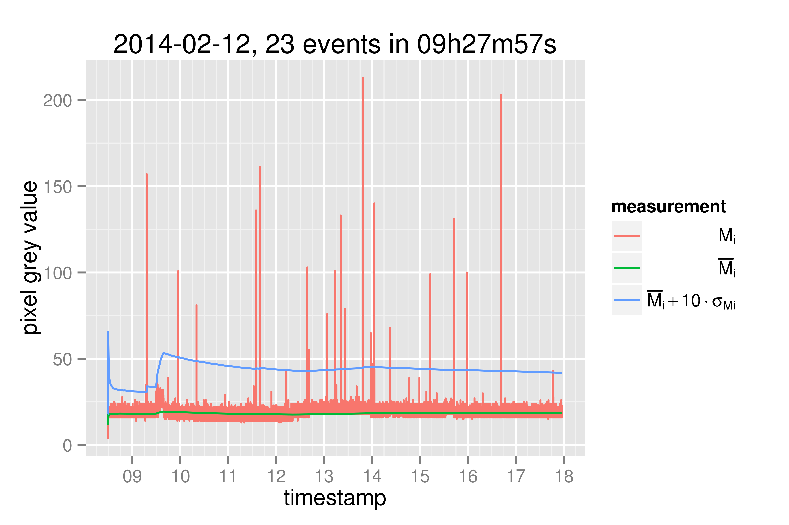

cosmic
======

Experiments with cosmic ray detection (!?)

Here it is an image with an anomalous pixel trails:

Here it is a summary of activities on February the twelfth, 2014:

[Some simple algorithms for detecting anomalous bright pixels](./doc/some_simple_algorithms_for_detecting_anomalous_bright_pixels.pdf)
